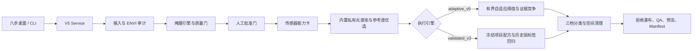

# CoreSpec Mapper V5.2 技术路线与方法总体设计

- 版本：5.2.0
- 日期：2026-07-21
- 文档状态：与 V5.2 源码、本地安装、NC-1 全景回归和 110 项自动化测试同步
- 适用对象：算法研发、软件维护、地质解释、项目配置、测试验收与发布评审

## 1. 结论与设计定位

CoreSpec Mapper V5.2 已形成两条边界清楚、输出可审计的执行路线：

1. `adaptive_v5` 是面向新项目的通用自适应矿物证据路线。它根据传感器波段、内置标准谱、场景样本和空间风险自动优选参考谱与阈值，适合探索和跨项目应用。
2. `validated_v3` 是面向已有可靠人工成果的项目冻结验证路线。它复用经过人工实验验证的参考谱、阈值和分类规则，用于恢复既有项目结果、做逐像元回归和隔离软件改动风险。

两条路线共享输入审计、掩膜质量门、人工批准、运行目录、质量报告和 Manifest，但不混用参数来源。NC-1 当前生产基线采用 `validated_v3`；`adaptive_v5` 继续用于新数据技术探索，不能用无标签代理阈值替代已有项目基准。

V5.2 对 NC-1 5,446 × 320 × 212 SWIR 全景完成复跑。批准掩膜为 332,814 像元，覆盖 19.0974%，内部填充率 94.6396%；平衡档与敏感档共 14 个“档位×矿物”结果相对冻结历史流程均达到 IoU、Precision、Recall = 1.000，工程质量 A，`publishable=true`。

该结论表示历史流程弱标签回归等价，不表示已经获得独立矿物学精度。真正的矿物准确率仍需 XRD、拉曼、薄片或配准点光谱真值验证。

## 2. V5.2 主要问题闭环

| V5.1/测试记录线索 | 根因判断 | V5.2 闭环措施 | 发布判据 |
|---|---|---|---|
| 自动掩膜只剩托盘轮廓和裂缝 | 总面积门无法识别空心轮廓；通用光谱回退不适配 NC-1 | 接入 GeoCore M1-2 适配器；新增内部填充率、覆盖率、组件和边缘网络检查 | 掩膜通过几何门且人工批准 |
| 当前矿物结果与人工实验明显不一致 | 掩膜错误与算法/阈值变更耦合，无法判断责任层 | 先冻结人工掩膜，再用 `validated_v3` 恢复历史参考谱与阈值；逐像元比较 | 14 项回归全部过门 |
| 阈值是否可靠不可解释 | 只有最终分类，没有候选过程和拒绝原因 | 自适应路线保留完整候选目标；两条路线均输出逐组拒绝瀑布 | 候选、阈值、拒绝计数可追溯 |
| 未检查掩膜就能直接运行 | 运行按钮缺少明确前置状态 | 新增掩膜预览、批准记录与后端硬门；桌面流程改为八步 | 未批准时前后端均阻断 |
| 可选 NIR 仅有头文件导致项目报错 | 伴随数据和主分析数据校验未分级 | 孤立 ENVI 头文件转结构化警告；有效 SWIR 主数据可继续 | 警告可见且不误中断 |
| 结果页面不便核对 | 预览比例和运行状态信息不足 | 增加适合窗口、50%、1:1、200% 缩放，滚动平移、ETA 和质量状态 | 可查看原始像元比例和风险 |
| Warning 仍显示绿色完成 | “运行结束”与“可发布”混为一体 | 按质量等级与 `publishable` 分离完成状态 | C/Warning 或不可发布不显示为无条件成功 |

## 3. 总体架构与数据流

| 模块 | V5.2 职责 |
|---|---|
| `desktop_v5.py` | 八步桌面流程、状态门、引擎选择、阈值导出、ETA、缩放预览与质量提示 |
| `v5_service.py` | 配置解析、输入角色、审计快照、运行调度、独立目录与成果清单 |
| `masking.py` | 光谱回退掩膜、外部掩膜读取、覆盖/填充/组件质量指标和批准状态 |
| `geocore_mask_adapter.py` | GeoCore M1-2 部署检查、滑窗模型调用与 RGB→SWIR 网格适配入口 |
| `spectral_db.py` / `spectral_v5.py` | 内置 SQLite 光谱库、矿相解析、纯度/QC、来源与哈希追溯 |
| `v5_library.py` | 传感器覆盖门、重采样、样品去重、稳健中心和多样性选谱 |
| `v5_calibration.py` | Catalog 安全包络内的自适应阈值搜索与完整候选记录 |
| `validated_v3.py` | 项目冻结配方、平衡/敏感运行、结果映射与拒绝瀑布 |
| `v5_validation.py` | 掩膜和逐矿物 IoU、Precision、Recall、面积差发布门 |
| `qa.py` | 输出完整性、嵌套、空间形态、固定列风险与质量等级 |

## 4. 输入模型与数据职责

### 4.1 主分析数据

`inputs.analysis_image` 是唯一驱动像元级矿物识别的 ENVI 立方体，并定义最终行列网格。运行前检查数据体、头文件、行列波段数、波长、坏波段、有限值比例和数据物理。

RGB、NIR、SWIR 伴随路径用于来源记录和能力说明。未经配准的伴随数据不会按文件名相邻而自动逐像元融合。可选伴随数据若只有 `.hdr` 而缺数据体，系统记录结构化警告；只要主分析 SWIR 有效，项目可继续。

### 4.2 预处理

1. 根据头文件确定有效波长与坏波段。
2. 对未平滑输入默认执行 11 波段、二阶 Savitzky–Golay 平滑；若数据已完成 SG 处理，必须设置 `input_is_smoothed=true`。
3. 从全深度分层抽取场景样本，默认 12 个深度块、每块 64 行，科学样本最多 128 行。
4. 估计稳健列光谱偏差和固定列风险。列校正仅参与高召回族级候选，诊断吸收中心和相似矿物竞争仍在原始 SG 域完成。

## 5. 岩心前景掩膜路线

### 5.1 引擎优先级

| 掩膜来源 | 适用条件 | V5.2 策略 |
|---|---|---|
| GeoCore M1-2 | 模型代码、注册表、Manifest、权重和配准参数齐备 | 自动模式首选；滑窗推理后适配到主 SWIR 网格 |
| 已批准同网格人工掩膜 | 项目已有人工实验成果或自动模型尚未部署 | 生产优先；不擅自清除人工小斑块，但仍执行质量审计 |
| 光谱回退掩膜 | 无模型包、无人工掩膜时的探索性备选 | 只作为候选；必须通过覆盖/填充门并人工批准 |

GeoCore M1-2 原算法来自 `E:/Code/Geocore_M0&1_Preprocessing/modules/M1-2_foreground_mask`（仓库根目录为 `E:/Code/Geocore_M0&1_Preprocessing`）。V5.2 已完成调用适配和部署状态检查，但当前交付目录缺少 `geocore_mask/models/registry.py`、`models/core_mask_unet_v1/model_manifest.json` 及 Manifest 指向的模型权重，因此不能宣称已完成真实模型推理。模型包补齐前，NC-1 使用冻结人工掩膜。

### 5.2 掩膜质量门

掩膜必须同时接受数值、几何和人工三层检查：

- 最小覆盖率默认 5%，防止只提取少量裂缝或反光点；近全幅背景同样阻断。
- 内部填充率默认至少 65%，用于识别“外轮廓通过但岩心内部为空”的结果。
- 统计连通分量、最大分量、边缘网络、碎片化和移除像元。
- 自动掩膜必须生成预览并记录审核人、审核时间和备注。
- `mask.approval.required=true` 且 `approved=false` 时，桌面端与服务端都不得进入矿物分类。

NC-1 V5.2 光谱回退仅得到 56,023 像元，覆盖 3.2147%，对人工掩膜召回约 16.06%，低于 5% 默认门，已被正确阻断。批准人工掩膜为 332,814 像元，内部填充率 94.6396%，通过质量门。

## 6. 传感器能力与内置光谱库

软件内置只读 SQLite 光谱库，包含 27 个源库、1,783 条测量、1,143 个归并样品、27 个 Catalog 目标和 428 条纯相 eligible 候选。24 个目标具备可运行 SWIR 配置，其中 7 个为默认已验证目标，17 个为实验级目标；赤铁矿、针铁矿和石英因物理条件不足关闭。

每个目标进入运行前必须满足：专家已实现、数据物理兼容、诊断窗口覆盖充足、有效波段/FWHM 条件可接受、库内存在可重采样的纯相 QC 合格参考谱。

参考谱选择顺序为：

1. 过滤纯相、QC、来源角色和目标矿相。
2. 根据传感器波长与 FWHM 重采样；FWHM 缺失时使用受最大间隙限制的插值并给出警告。
3. 按物理样品去重，避免重复测量放大先验。
4. 以矿物候选的稳健 medoid 起始。
5. 依谱形多样性、曲线质量、新来源族和新测量几何逐条加入。
6. 保存入选/未选原因、曲线、样品、来源和数据库/Catalog 哈希。

## 7. `adaptive_v5` 通用自适应路线

### 7.1 组级候选与相似矿物竞争

算法先在同一光谱竞争族内计算组级 SAM 高召回候选，再用分段线性连续统、吸收深度、中心位置、形状、间隔和内部混淆矿物进行类别竞争。这样避免把光谱物理完全不同的矿物放入无约束全局分类器。

### 7.2 阈值优选

每个竞争族、每个档位在 Catalog 规定的安全包络中联合搜索列分位阈值和 absolute SAM 上限。代理目标综合：

- 光谱证据强度；
- 最低有用覆盖；
- 非孤立空间支持；
- 固定列、边缘、孤立小斑块与过覆盖惩罚。

所有候选组合、目标分量、拒绝原因、并列决策和最终值写入 `thresholds.json`。搜索不得越过安全包络，也不设置“每种矿物必须检出”的配额；零检出可以是合理结果。

该策略是在无像元真值条件下的工程代理优选。它适合新项目筛查和形成待验证假设，不应描述成有监督最优阈值。

### 7.3 三档证据门

Conservative、Balanced、Sensitive 三档共享底层证据，并分别应用吸收深度、类别间隔、参考谱共识、稳定性、置信度和空间清理门。三档必须满足严格档包含关系；Balanced 为默认解释基线，Sensitive 用于召回复核，Conservative 用于高置信候选。

## 8. `validated_v3` 项目冻结路线

该路线用于回答“软件升级后能否稳定恢复之前人工实验认可的结果”。其原则是：

1. 固定输入 SWIR、同网格人工掩膜、参考谱、平衡/敏感配方和历史结果目录。
2. 不运行自适应阈值替换冻结项目参数。
3. 逐组生成候选、光谱/深度/分类证据拒绝、空间清理和最终分类计数。
4. 对每个档位、每个矿物计算 IoU、Precision、Recall 和面积差。
5. 任一发布门失败即令验证失败，不以总体平均掩盖单矿物退化。

NC-1 配置为 `configs/nc1_v5_2_validation.json`，历史结果只作为弱标签。此路线证明数据读取、掩膜、参考谱、参数、分类和空间处理的回归等价，不证明历史人工结果本身就是矿物真值。

## 9. 拒绝瀑布与可解释性

`rejection_waterfall.json` 按组记录：

1. 材料掩膜内像元；
2. 初始候选；
3. 光谱证据拒绝；
4. 吸收深度或特征拒绝；
5. 类别竞争/间隔拒绝；
6. 空间伪影清理；
7. 最终各矿物分类数量。

瀑布用于定位“没有结果”发生在哪一层，也用于判断阈值放宽是否只增加条带、边缘或孤立噪声。它不替代光谱曲线和地质背景复核。

## 10. 八步桌面流程

| 步骤 | 用户任务 | 系统关键反馈/门禁 |
|---|---|---|
| 1. 项目 | 项目名、说明、输出根目录 | 输入只读、独立 run_id、非覆盖保存 |
| 2. 数据 | 主分析立方体和可选伴随数据 | 尺寸、波长、可读性、孤立头文件警告 |
| 3. 掩膜 | 选引擎、生成/加载、预览并批准 | 覆盖率、内部填充率、组件、模型状态和批准门 |
| 4. 矿物 | 按矿物族选择目标 | 支持级别、窗口、参考谱数和限制原因 |
| 5. 模式 | 选择 `adaptive_v5` 或 `validated_v3` | 明确参数来源和适用范围 |
| 6. 阈值试算 | 查看或导出候选/冻结阈值 | 候选范围、拒绝原因、JSON 导出 |
| 7. 运行 | 启动、监控、取消 | 阶段进度、耗时、非递增 ETA、结构化告警 |
| 8. 结果 | 复核分类、QA 与 Manifest | 档位切换、50%/1:1/200% 缩放、滚动平移、质量状态 |

## 11. 输出合同与发布门

每次运行必须使用独立目录并至少保存：

- `config.resolved.json` 与项目记录；
- 掩膜 ENVI、掩膜审计、批准记录和预览；
- 参考谱选择及曲线来源；
- `thresholds.json`；
- 三档分类/中间证据 ENVI 产品；
- `rejection_waterfall.json`；
- `validation_report.json`（配置回归时）；
- `quality_report.json`、`summary.json` 和 `run_manifest.json`。

发布必须同时满足：运行完成、必需输出可重开、分类在掩膜内、档位关系正确、质量门通过、要求的回归门通过、掩膜已批准。工程质量 A/B/C/D 反映输入与输出一致性、伪影控制和审计完整性，不是矿物学准确率。

## 12. 验证体系

| 证据级别 | 说明 | 可支持的结论 |
|---|---|---|
| L0 自动化测试 | 110 项代码与界面测试 | 关键函数、CLI、服务和桌面状态符合合同 |
| L1 工程运行 | 全景数据成功执行并可重开成果 | 软件链路可运行、产物完整 |
| L2 历史弱标签回归 | NC-1 14 项逐像元一致 | 冻结历史流程可重复，升级未改变基准结果 |
| L3 配准点/区真值 | XRD、拉曼、薄片或点光谱与像元对齐 | 可估计矿物级 Precision/Recall 和阈值 |
| L4 跨钻孔盲测 | 不参与调参的独立钻孔 | 可评估外推能力和生产适用范围 |

V5.2 当前达到 L2。对 `adaptive_v5` 的生产推广仍应补齐 L3/L4。

## 13. 已知边界与下一阶段

- GeoCore M1-2 模型包和 RGB→SWIR 配准参数尚未齐备；自动掩膜生产能力不能虚报。
- 当前 RGB/NIR/SWIR 不自动配准融合；伴随数据不能直接扩展主分析光谱域。
- 现有 NIR 起始约 691 nm 且 RGB 不是校准高光谱，赤铁矿/针铁矿矿物级分相关闭。
- 无 TIR 发射率数据和兼容库，石英识别关闭。
- 17 个实验级 SWIR 目标虽可运行，但缺少专项真值验收，默认不勾选。
- 历史弱标签只解决回归正确性，不能替代矿物真值。

下一阶段优先级为：补齐 GeoCore 模型包并做配准验收；按深度段采集独立矿物真值；在盲测钻孔上评价 `adaptive_v5` 阈值外推；把新真值转为版本化项目配方和发布回归集。

## 14. 关键配置与源码索引

| 文件 | 用途 |
|---|---|
| `configs/nc1_v5_2_validation.json` | NC-1 全景冻结配方复跑 |
| `configs/nc1_v5_2_regression.example.json` | 掩膜和分类回归门示例 |
| `configs/v5_default.json` | 新项目通用自适应模板 |
| `src/corespec_mapper/validated_v3.py` | 冻结项目配方与拒绝瀑布 |
| `src/corespec_mapper/v5_validation.py` | 逐像元回归指标和发布门 |
| `src/corespec_mapper/geocore_mask_adapter.py` | GeoCore M1-2 适配与部署检查 |
| `src/corespec_mapper/masking.py` | 掩膜生成、质量门与审计 |
| `src/corespec_mapper/v5_calibration.py` | 自适应阈值候选搜索 |
| `src/corespec_mapper/desktop_v5.py` | 八步桌面流程 |
