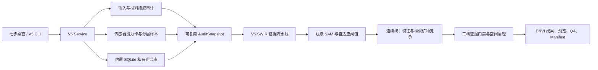

# CoreSpec Mapper V5 自适应矿物证据引擎软件总体设计方案

- 版本：5.0.0
- 日期：2026-07-20
- 文档状态：与当前代码、内置 SQLite 光谱数据库和四组 V5 验证运行同步
- 适用对象：软件研发、算法复核、地质解释、测试验收与后续光谱库扩展

## 1. 文档目的与结论

CoreSpec Mapper V5 将 V4 的“单一 SWIR 立方体 + 外部光谱库路径 + 固定式阈值”工作流重组为可审计的桌面应用和后端服务。V5 的核心变化不是增加一个界面外壳，而是把数据角色、传感器能力、私有标准谱、阈值搜索、相似矿物竞争、伪影控制与运行追溯放入同一条可复现链路。

当前版本已经具备以下可用能力：

1. 默认从软件包内只读加载私有 SQLite 光谱数据库，用户不再填写光谱库路径。
2. 接受主分析立方体和可选 RGB、NIR、SWIR 伴随数据，明确“主数据驱动识别、伴随数据记录来源”的职责边界。
3. 按一级矿物族、二级矿物选择目标，同时用光谱竞争族组织后端算法。
4. 对 13 个 SWIR 目标建立数据库、参考谱优选与运行时配置；其中 7 个为当前默认的已验证 SWIR 目标，6 个为实验级扩展目标。
5. 通过材料掩膜、分层抽样、传感器能力卡、标准谱重采样、组级 SAM、分段线性连续统、矿物特征竞争、自适应阈值、证据门禁和空间伪影清理生成三档结果。
6. 审计快照可在同一进程的后续运行中复用，避免原先隐藏的第二次审计与重复选谱。
7. 每次运行创建独立目录，写出 ENVI 栅格、阈值候选、参考谱来源、质量报告和带哈希的 Manifest。

这里的“可用”是工程意义上的端到端可运行和结果可复核，不是已证明矿物学准确率。当前没有像元级 XRD、拉曼、薄片或点光谱真值；PPT 人工解释和钻孔编录只能作为定性约束。质量等级 A/B/C/D 衡量输出完整性、三档嵌套、空间聚集、固定列风险和输入条件，不能解释为准确率。

## 2. V4 审计问题与 V5 对应设计

| V4 审计发现 | 风险 | V5 对应措施 |
|---|---|---|
| 输入模型强制为一个分析立方体和同尺寸掩膜 | 无法表达 RGB/NIR/SWIR 数据角色，也容易误把未配准数据强行融合 | 引入 `inputs.analysis_image` 主分析角色与 `rgb`、`nir`、`swir` 伴随角色；未配准伴随数据不参与像元计算 |
| 前端要求用户填写 `spectral_library_root` | 路径复杂、环境不可复现、选谱资源不可追溯 | 内置 `corespec_spectral_v5.sqlite3`；服务层自动定位，桌面配置主动移除旧光谱库路径字段 |
| 旧名称模糊匹配会把 Prehnite、Talc、Ilmenite、Quartz Monzonite 等错归目标矿物，IGCP 下划线名称又会漏匹配 | 标准谱候选受污染 | 使用来源感知、前缀边界、纯度和混合物判定；岩石、植被、水体等资源保留在数据库但不进入纯矿物候选 |
| Anchor 可能占满每矿物名额，自动优选名不副实 | 标准谱缺少来源和谱形多样性 | V5 当前无强制 Anchor；默认以稳健 medoid 起始，再按谱形、质量、来源族与测量几何贪心选取；未来配置 Anchor 时最多保留 2 条 |
| 阈值实际接近固定场景分位数 | 对不同影像质量和背景比例适应不足 | 在 Catalog 安全包络中搜索列分位与绝对 SAM 阈值，使用空间代理目标选优并保存全部候选 |
| 无标签矿物的场景中位数偏移会把不存在的矿物“扶正” | 制造伪检出 | V5 关闭 scene-domain offset，保持原始证据域，不对无标签矿物做中位数扶正 |
| 置信度阈值使用 Catalog 与场景阈值的较小值 | 坏场景反而可能放宽门槛 | V5 使用安全下限，即取两者较大值 |
| 共识和稳定性门槛偏空 | 单条参考谱偶然匹配可能通过 | 三档均启用参考谱共识、稳定性和置信度门禁 |
| 逐像元上包络连续统耗时高 | 全图运行时间和内存不可控 | V5 使用按光谱窗口分段的向量化直线连续统；V4 上包络实现仅作为兼容路径保留 |
| SFF 默认权重为 0 仍计算完整矩阵 | 无收益的计算开销 | 权重为 0 时跳过 SFF 矩阵，只保留中性诊断平面 |
| 审计与运行重复读取、重复平滑、重复扫描光谱库 | 隐藏耗时 | `V5AuditSnapshot` 缓存掩膜、样本、能力卡、列偏差和参考谱；相同输入与资源哈希时复用 |
| Manifest 自身哈希和空间来源信息不清 | 审计链不完整 | Manifest 明确排除自身递归哈希；ENVI 输出写入源数据路径、源总行列、输出行区间和继承的空间元数据 |

## 3. 总体架构

主要模块职责如下：

| 模块 | 责任 |
|---|---|
| `desktop_v5.py` | 七步桌面流程、项目配置、矿物树、参考谱曲线、阈值表、风险摘要和成果预览 |
| `v5_service.py` | 输入角色、审计快照、内置资源定位、运行目录、Manifest、阈值与 Al-OH 亚型产品 |
| `masking.py` | 自动或外部同网格材料掩膜、连通域清理和质量门禁 |
| `spectral_db.py` / `spectral_v5.py` | 私有数据库、来源角色、矿物名称解析、纯度/QC、只读访问与扩展协议 |
| `v5_library.py` | 传感器覆盖检查、重采样、样品去重、medoid/多样性参考谱优选 |
| `v5_calibration.py` | Catalog 包络内的分层空间代理阈值搜索 |
| `v4_pipeline.py` + `swir_expert.py` | V5 当前复用的稳定栅格执行器、组级 SAM、连续统证据、矿物竞争、三档门禁和输出 |
| `artifacts.py` / `qa.py` | 固定列、方向性细条带、连通域、三档嵌套、输出完整性和质量报告 |

复用 `v4_pipeline.py` 是内部实现层的稳定栅格执行器选择，不代表运行算法仍是 V4。服务注入 V5 Runtime Catalog、V5 内置参考谱、分段线性连续统、自适应阈值以及 V5 安全门禁；Manifest 和最终 ENVI 科学成果均记录 V5 身份。

## 4. 七步桌面信息架构

V5 主窗口固定为以下七步，避免把数据、算法参数和结果零散堆在一个页面：

| 步骤 | 用户任务 | 系统反馈 |
|---|---|---|
| 1. 项目 Project | 设置项目名、说明和输出根目录 | 强调输入只读、独立 `run_id`、非覆盖式保存 |
| 2. 数据 Data | 选择主分析立方体；可附加 RGB/NIR/SWIR | 显示尺寸、波段范围、数据物理和可读状态；不会要求光谱库路径 |
| 3. 掩膜 Mask | 选择自动材料掩膜或外部同网格 ENVI 掩膜 | 审计后显示覆盖比例、像元数、连通域与风险；运行目录保存 ENVI 掩膜和 PNG 预览 |
| 4. 矿物 Minerals | 按一级矿物族、二级矿物勾选 | 显示支持级别、关键波段、候选参考谱数和限制原因 |
| 5. 模式 Mode | 选择结果页的默认查看档，必要时展开高级参数 | 默认查看平衡档；科学运行固定写出三档共享证据结果 |
| 6. 证据审查 Evidence Review | 查看自动入选标准谱、谱形、来源、阈值候选范围和风险 | Audit 阶段显示安全候选范围；完整运行后再显示最终阈值和全部候选目标值 |
| 7. 运行结果 Run & Results | 查看三档分类、条带诊断、Al-OH 亚型、质量等级与日志 | 支持加载既有运行目录并复核 Manifest 与预览 |

当前实现边界必须明确：

- Audit 阶段已经完成输入、掩膜、能力、分层样本和参考谱优选，但阈值代理目标在映射阶段才求解。因此运行前显示候选范围，最终值在运行完成后的 `thresholds.json` 与 Manifest 中出现。
- Quick Calibration 控件被禁用并明确提示缺少像元真值；桌面构建配置时强制 `quick_calibration=false`。当前阈值搜索是无标签空间代理优化。
- “同时输出三档”固定勾选且被禁用；桌面构建配置时强制 `write_all_profiles=true`。科学运行始终输出三档，以确保嵌套验收和复核。
- `mode.profile` 只控制结果页默认查看偏好，不改变科学计算或输出内容。

## 5. 多传感器输入模型

### 5.1 数据角色

| 配置字段 | 是否必需 | 当前作用 |
|---|---:|---|
| `inputs.analysis_image` | 是 | 唯一驱动像元级矿物识别、掩膜、能力卡、抽样和成果空间网格的 ENVI 立方体 |
| `inputs.rgb` | 否 | 读取并记录尺寸、路径、头文件哈希和来源；当前不参与像元级分类 |
| `inputs.nir` | 否 | 同上；当前不会与主立方体自动配准或融合 |
| `inputs.swir` | 否 | 同上；当它本身是主分析数据时可与 `analysis_image` 指向同一文件 |
| `mask.path` | 外部模式必需 | 必须与主分析立方体同网格；非零、有限像元构成有效材料 |

未配准的 RGB、NIR、SWIR 不能因为文件名相邻就逐像元拼接。若需要联合 691–2518 nm 分析，应先在 GeoCoreFusion 等流程中完成配准与光谱轴协调，再把已配准连续立方体作为 `analysis_image`。四组验证中的两组低分辨率快速回归就是这一模式。

### 5.2 数据物理与波段门禁

运行时依据真实波长、坏波段、FWHM、数据物理和参考谱数生成 Sensor Capability Card。目标矿物只有在下列条件同时满足时才进入运行：

1. 对应专家已实现；
2. 主立方体数据物理兼容；
3. 每个必需诊断窗口覆盖率至少 97%，且每窗口至少 3 个波段；
4. Runtime Catalog 的最低有效波段数与最大有效 FWHM 条件满足；
5. 私有库中存在纯相、QC 合格、物理兼容且可重采样的参考谱。

FWHM 缺失时不会伪造卷积参数，而采用限制跨大间隙的插值并给出 `FWHM_UNKNOWN` 警告。

## 6. 矿物体系与当前能力边界

### 6.1 两级分类与算法竞争层

面向用户的两级分类是“一级矿物族 → 二级矿物”。后端另设“光谱竞争族”，只让诊断窗口和谱形相近的矿物直接竞争，避免把所有矿物放入一个无物理约束的全局分类器。

| 一级矿物族 | 二级矿物 |
|---|---|
| 碳酸盐矿物 | 方解石、白云石 |
| 硫酸盐矿物 | 硬石膏、石膏、明矾石 |
| 含水层状硅酸盐 | 伊利石、白云母、蒙脱石、高岭石、地开石、叶蜡石、绿泥石 |
| 其他热液硅酸盐 | 绿帘石 |
| 铁氧化物与氢氧化物 | 赤铁矿、针铁矿 |
| 无水硅酸盐 | 石英 |

### 6.2 13 个 SWIR 目标

| 光谱竞争族 | 矿物 | 主要检测窗口（nm） | 当前成熟度 |
|---|---|---|---|
| `carbonate_2300` | 方解石、白云石 | 2248–2402 | 已验证 SWIR |
| `calcium_sulfates` | 硬石膏、石膏 | 1350–1800；1850–2300 | 已验证 SWIR |
| `white_mica_illite` | 伊利石、白云母 | 2100–2250；2300–2380 | 伊利石已验证；白云母实验级 |
| `smectites` | 蒙脱石 | 1350–1455；1850–1985；2100–2256 | 已验证 SWIR |
| `kaolin_2170_2205` | 高岭石、地开石 | 2120/2140–2240 | 高岭石已验证；地开石实验级 |
| `al_oh_2165` | 叶蜡石 | 2100–2225；2280–2350 | 实验级 SWIR |
| `mg_fe_oh` | 绿泥石 | 2200–2400 | 实验级 SWIR |
| `acid_sulfates` | 明矾石 | 1400–1800；2050–2250 | 实验级 SWIR |
| `epidote_family` | 绿帘石 | 1500–1585；2200–2360 | 实验级 SWIR |

桌面默认只勾选 7 个 `validated_swir` 目标：方解石、白云石、硬石膏、石膏、伊利石、蒙脱石和高岭石。白云母、地开石会在默认运行中作为相似矿物内部竞争者加入，但不一定作为输出类别。用户主动选择其余实验级目标时，应在结果中保留“实验级”说明。

白云母—伊利石相位分离仍是条件性的。V5 额外输出 Al-OH 吸收中心亚型：

- 短波：< 2201 nm；
- 中波：2201–2209 nm；
- 长波：≥ 2209 nm。

这个亚型是光谱组成描述，不能直接等同于确定的伊利石/白云母相位。

### 6.3 Fe 族级证据与石英限制

- 赤铁矿和针铁矿需要约 450–1000 nm 的完整可标定 VNIR 信息。当前实测 NIR 从 691 nm 开始，RGB 又不是校准的高光谱 VNIR，因此缺少 450–691 nm 的关键可见光特征。V5 数据库保存两类标准谱和关键特征，但矿物级专家未实现、前端目标锁定。后续最多先实现“铁氧化物族辅助证据”，不能在现有数据条件下宣称稳定分相。
- 石英在 VNIR/SWIR 中通常缺少稳定强诊断吸收，当前设计要求 7.5–14 µm TIR 发射率及兼容发射率参考谱。现有数据无 TIR，JHU 相关资源是双锥反射率而非兼容发射率，故石英识别关闭。

## 7. 内置私有光谱数据库

软件包资源 `resources/corespec_spectral_v5.sqlite3` 为只读主库，当前 SHA-256 为 `99550638dc0b1beac2133a31b6da4de30436168ebe5eb02dab56d90381150f0b`。数据库包含：

- 27 个源 ENVI 光谱库；
- 1,783 条测量；
- 1,143 个归并样品；
- 16 个目标矿物定义；
- 288 条可进入运行时选谱的纯相、QC 合格候选；
- 每个源文件、头文件、波长轴、数值序列和整条光谱的哈希；
- 来源角色、数据物理、测量几何、矿物相、纯度、样品 ID、数值 QC 和标签冲突状态。

数据库把 10 个矿物标准库与岩石、土壤、植被、水、冰雪、陨石、月壤和人造物等资源分开。非矿物标准资源仍保留用于来源审计和未来背景/混淆研究，但不会进入纯矿物参考候选。详细清单见同目录的《CoreSpec Mapper V5 私有光谱数据库清单与识别能力》。

### 7.1 标准谱自动优选

每个目标的运行时选谱顺序如下：

1. 仅查询 `catalogued=1`、`declared_pure`、`qc_status=eligible`、`source_role=mineral_reference` 的同相测量。
2. 检查专家、数据物理、必需窗口覆盖和最低波段数；不满足即给出结构化不可用原因。
3. 有 FWHM 时用高斯 FWHM 卷积；无 FWHM 时用受最大间隙约束的插值。
4. 在必需窗口内计算覆盖率、吸收深度、二阶粗糙度和谱形质量。质量为 0.55×覆盖 + 0.25×平滑 + 0.20×对比度。
5. 依据 `sample_id` 合并同一物理样品的重复测量，防止重复测量提高先验权重。
6. 若 Catalog 配置了 Anchor，最多优先保留 2 条；当前 5.0.0 Catalog 的 Anchor 列表为空，所以四组验证均从稳健 medoid 开始。
7. 无 Anchor 时选择与同矿物候选的中位谱形角最小的 robust medoid。
8. 后续参考谱按以下得分贪心加入：

   `selection = 0.50 × 谱形多样性 + 0.25 × 质量 + 0.20 × 新来源族 + 0.05 × 新测量几何`。

9. 默认数量为 `min(maximum, 独立样品数, max(minimum, ceil(sqrt(独立样品数))))`；服务默认每矿物最多 6 条，示例配置设为 4 条。
10. 输出入选顺序、选择原因、未选原因、来源、样品、曲线和数据库/Catalog 哈希，供桌面曲线图和 Manifest 复核。

第一组原始 3DSSZ 验证的 9 个输出目标/内部竞争者共选择 29 条参考谱，全部采用 `robust_medoid_plus_diversity`；这说明当前结果没有依赖人工 Anchor 占位。

## 8. 材料掩膜

### 8.1 外部掩膜

外部掩膜必须与主立方体行列一致。单波段或抽取首/中/末波段后，有限且绝对值大于 `1e-10` 的像元视为有效。默认不清理外部掩膜的小连通域，以免改变人工成果；但仍统计连通域、覆盖率和碎片化风险。

### 8.2 自动掩膜

自动模式最多分层选择 9 个分析波段，按行块读取，仅保留亮度和光谱对比度两个 `float32` 平面：

1. 至少 70% 所选波段有限且为正；
2. 估计边界背景的稳健亮度/对比度中心与尺度；
3. 正常场景使用 `0.70 × 亮度距离 + 0.30 × 对比度超量`，再以 Otsu 和边界保护确定阈值；
4. 若边界异质性 > 0.25，判断为裁剪 ROI 的边界背景模型失效，退回全局亮度 Otsu；
5. 默认删除小于 `max(8, 总像元×0.0001)` 或用户指定阈值的 8 连通域。

硬门禁为：最终有效像元至少 128 且覆盖至少 0.5%；覆盖不得超过 85%。过小、近全幅或有效光谱不足会阻断运行；大量碎片只给出警告并要求人工复核。

## 9. 光谱预处理与列伪影控制

### 9.1 SG 平滑

默认对主立方体使用 11 波段、二阶 Savitzky–Golay 平滑。实现按窗口 offset 累加，不构造“像元×窗口”滑动视图临时量，峰值内存与输入块成比例。若输入已经 SG 平滑，用户必须显式设置 `input_is_smoothed=true`，避免重复平滑。

### 9.2 全深度分层样本

默认从全深度选择 12 个、每个 64 行的材料块，并把科学样本确定性限制为最多 128 行。样本用于传感器噪声、列偏差、场景阈值和置信度尺度估计，不等同于训练标签。

### 9.3 稳健列光谱校正

系统对样本的每个探测器列计算稳健光谱剖面，再与邻列中位数比较，得到 `column_bias`。默认以 0.70 强度用于组级高召回候选检测。相似矿物的连续统、峰位和子类竞争仍在原始 SG 光谱域进行，避免列校正扭曲诊断中心。

固定列风险还会从多个深度块的重复响应和相邻列超量估计，进入置信度衰减及后处理，而不是简单整列删除。

## 10. V5 矿物证据链

### 10.1 组级 SAM 候选

每个光谱竞争族只在其检测窗口内计算像元与全部入选参考谱的 SAM。每矿物取最佳 `k=1` 参考谱形成矿物级组证据，再取组内最小值作为组级候选分数。这样先判断“是否存在该谱族证据”，再进行相似矿物竞争。

候选必须同时满足：

- 在材料掩膜内；
- 光谱有限且为正；
- SAM 不高于运行时绝对阈值；
- SAM 不高于该探测器列的分位阈值。

### 10.2 Catalog 有界自适应阈值

每个组、每个三档策略分别搜索。Catalog 中 conservative 到 sensitive 的最小/最大值构成不可越过的安全包络。默认对列分位和绝对 SAM 各取 5 个线性候选，并加入该策略基线；因此当前 Manifest 中 conservative/sensitive 通常评估 25 对，balanced 通常评估 36 对。

候选目标函数为：

`J = 1.25E + 0.20U + 0.20S - 1.20Pcol - 0.70Pedge - 0.80Piso - 1.00Pover`

其中：

- `E`：在统一 Catalog 角度尺度上的中位证据强度；
- `U`：达到最低有用覆盖的效用；
- `S`：非孤立空间支持；
- `Pcol`：跨深度重复的固定列惩罚；
- `Pedge`：岩心边缘候选比例；
- `Piso`：≤4 像元小连通域比例；
- `Pover`：超过策略最大覆盖率的二次惩罚。

策略最大覆盖率默认分别为 8%、18% 和 30%，硬上限为 65%，至少需要 16 个候选像元。若安全包络内没有候选通过，算法阻断该阈值解析，不会越界放宽。所有候选、目标分量、拒绝原因和最终值写入 `thresholds.json`。

这是无标签工程代理最优，不是有真值的矿物准确率最优。当前实现明确不做矿物场景中位数偏移，也不设置最低检出配额；零检出是允许且会被报告的结果。

当两个参数组合产生相同候选掩膜和相同目标分量时，确定性并列规则依次偏向较低惩罚、较低覆盖、较小绝对 SAM 阈值和较小列分位，避免无收益地保留更宽阈值。

### 10.3 分段线性连续统

分类窗口的波长轴在大于典型间隔 4 倍的间隙处分段。每段以首末点建立直线连续统，向量化计算 `1 - R/C`。它保留不相连诊断窗口之间的独立基线，并消除 V4 逐像元上包络的主要耗时。

### 10.4 相似矿物竞争

对候选像元和每条参考谱计算四类证据：

1. 连续统吸收谱形角；
2. 对波长梯度的谱形角；
3. 吸收中心、窗口深度和深度比的特征距离；
4. SFF 拟合项。

当前全部 V5 Runtime Group 的 `fit` 权重为 0，因此实际得分由谱形、导数和特征组成；SFF 完整矩阵不会计算。每矿物取最佳 2 条参考谱得分均值，参考谱共识定义为落在最佳分数 `max(0.025, best×0.20)` 容差内的参考比例。

内部混淆矿物与输出矿物一起竞争。例如只输出伊利石时仍可让白云母竞争；若白云母胜出而未被请求，该像元不会被强制改标为伊利石。

### 10.5 三档证据门禁

三档共享同一组 SAM、连续统、特征和竞争结果：

| 档位 | 用途 | 相对要求 |
|---|---|---|
| Conservative / 严格 | 高可信核心 | 最低列分位、最低绝对角、最高深度/间隔/共识/稳定/置信门槛 |
| Balanced / 平衡 | 默认地质解释 | 在精度与召回之间折中 |
| Sensitive / 敏感 | 检查潜在漏识别 | 较宽候选和较低证据门槛，但仍受特征、共识、稳定、置信和空间清理约束 |

通过顺序为：

1. 组级绝对 SAM 与列阈值；
2. 最小连续统吸收深度；
3. 矿物特征中心/比值门禁；
4. 最优与次优矿物得分间隔；
5. 入选参考谱共识；
6. 标签一致性、间隔与共识组成的稳定性；
7. SAM、原始分数、间隔、共识、深度、稳定性组成的综合置信度；
8. 空间伪影过滤。

场景置信度分位只会提高而不会降低 Catalog 下限。最终强制 `Conservative ⊆ Balanced ⊆ Sensitive`，且类别必须一致；不一致像元从更严格档移除。

## 11. 空间清理与地质合理性控制

V5 不用“结果必须非零”作为成功标准，也不依赖人为矿物配额。空间后处理专门针对传感器和分割伪影：

- 根据 61 行窗口的纵向密度、邻列比例和横向支持识别弱证据方向条带；
- 对跨多个分层块重复的高风险固定列降置信，并清理窄残余列带；
- 清理高而窄、长宽比过大的弱证据连通域；
- 按档位清理过小弱证据连通域；
- 对材料边缘和 1600 nm 高反射饱和风险降低置信；
- 对达到类别自适应保护阈值的强证据细脉保留，避免把真实裂隙/脉体一并抹除。

质量报告进一步检查三档嵌套、掩膜一致性、置信度范围、同类 8 邻域支持和单列密度。一般地质聚集、裂隙和岩性边界只能作为定性复核；没有真值时，不能以“更团块”自动证明矿物类别正确。

## 12. 输出合同与 Manifest

每次运行路径为：

`<output_root>/<safe_project_name>/<run_id>/`

目录已存在时运行失败，不覆盖历史成果。标准输出包括：

| 路径 | 内容 |
|---|---|
| `project.csmproj` | 项目名、运行 ID、主分析数据、掩膜来源和非覆盖声明 |
| `config.resolved.json` | 用户配置与解析后的 V5 Runtime 配置 |
| `audit.json` | 输入、掩膜、能力卡、标准谱和运行前风险 |
| `capability/` | Sensor Capability Card、材料掩膜、抽样计划、矿物可观测性和列偏差 |
| `library_ensemble/` | 入选标准谱 ENVI 库、候选/拒绝清单、含完整曲线的 V5 选择记录 |
| `groups/<family>/` | 三档分类、组/矿物分数、阈值、连续统特征、置信度、稳定性、拒绝原因和条带掩膜 |
| `confidence/` | 跨组最大置信度、对应稳定性和拒绝原因 |
| `thresholds.json` | 安全范围、全部候选目标、最终列分位和绝对 SAM |
| `previews/` | 三档对比、各组叠加、1600 nm 背景、材料掩膜、条带诊断和 Al-OH 亚型 |
| `tables/mineral_counts.csv` | 各档、各组、各输出矿物的像元数 |
| `reports/` | JSON、Markdown、HTML 工程质量报告 |
| `run_manifest.json` | 输入指纹、资源哈希、标准谱、阈值、质量、耗时和输出清单 |

空间栅格继承可用的 ENVI 空间元数据，并增加源数据/头文件绝对路径、源总行列、输出结束行等定位字段。Manifest 的输出清单对关键 JSON、项目文件和所有 `.hdr` 记录 SHA-256；大体量 `.dat` 默认记录大小而不全量哈希，以控制收尾耗时。Manifest 自身明确排除在自身清单之外。

## 13. 四组实测运行证据

以下数值直接来自指定运行的 `run_manifest.json` 和 `tables/mineral_counts.csv`。平衡档计数按“碳酸盐 / 钙硫酸盐 / 白云母—伊利石 / 蒙皂石 / 高岭石双峰族”排列；它们是各组计数，不是跨组去重像元。

| 运行 | 主立方体 | 掩膜 | 平衡档组计数 | 总耗时 | 工程质量 |
|---|---|---|---|---:|---|
| `validation_runs/V5_Final_Raw_Validation/3dssz_raw_v5_final` | 5663×320×212，978.571–2518.46 nm | 外部同网格，222,783 像元，12.2938% | 1495 / 303 / 587 / 0 / 0 | 293.375 s | B / Warning |
| `validation_runs/V5_Final_Raw_Validation/zkh3_raw_v5_final` | 4341×320×212，978.571–2518.46 nm | 自动，521,852 像元，37.5671% | 802 / 3464 / 213 / 0 / 0 | 243.000 s | B / Warning |
| `validation_runs/V5_Final_Validation/3dssz_lowres_v5_final2` | 293×160×367，691–2518 nm | 自动，9,328 像元，19.8976% | 0 / 220 / 3 / 0 / 0 | 12.484 s | B / Warning |
| `validation_runs/V5_Final_Validation/zkh3_lowres_v5_final2` | 297×158×367，691–2518 nm | 自动，22,308 像元，47.5387% | 223 / 528 / 221 / 0 / 0 | 14.000 s | B / Warning |

两组原始运行都同时登记了 RGB、NIR、SWIR 源文件；分类仍由原始 SWIR 主立方体驱动。两组低分辨率运行使用 GeoCoreFusion 已对齐的连续立方体作为主数据。

掩膜审计仍需人工关注：3DSSZ 原始外部掩膜保留 159 个连通域并触发碎片化警告；ZKH3 原始自动掩膜采用裁剪 ROI 的全局亮度 Otsu 回退，从 531,190 个原始像元清除 9,338 个小组件像元后保留 521,852 个像元、263 个连通域，同样触发碎片化警告。ZKH3 低分辨率自动掩膜保留 45 个连通域并触发警告。它们未阻断工程运行，但正式地质解释前应复核材料掩膜。

四组均完成 312 个 Manifest 输出项和 24 个预览资产（23 张 PNG + 1 个 `legend.json`），材料掩膜与 Al-OH 亚型 PNG 均存在。质量状态均为 B / Warning，且都报告 FWHM 缺失和无像元真值。零检出的蒙脱石、高岭石或个别其他矿物被保留为真实警告，没有通过配额制造检出。因此这些运行证明的是：

- 原始和协调低分辨率数据均可端到端完成；
- 外部与自动材料掩膜均能进入同一流程；
- 三档结果、阈值、参考谱、预览和 Manifest 完整生成；
- 不能据此计算或宣称矿物准确率。

## 14. 接口与扩展点

### 14.1 当前稳定接口

- CLI：`v5-audit`、`v5-run`、`v5-catalog`、`v5-library`、`desktop`。
- Python：`audit_v5_project(config)`、`run_v5_project(config, output_root, ...)`、`build_v5_library_ensemble(...)`。
- Catalog：知识 Catalog 管分类、波段、成熟度和限制；Runtime Catalog 管处理窗口、特征、门禁和空间清理。
- 数据库：`V5SpectralDatabase` 以 SQLite `mode=ro` 打开内置库。

### 14.2 预留但尚未完成的扩展

1. `SpectralOverlayProvider.database_paths()` 已定义用户覆盖库协议，但当前 `V5SpectralDatabase` 尚未合并这些路径；不能把它描述为已可用的导入功能。
2. RGB/NIR/SWIR 已有独立输入角色，但自动配准、像元级融合和铁氧化物族专家未实现。
3. VNIR 反射率和 TIR 发射率专家在 Catalog 中注册为未实现；新增专家必须同时提供数据物理、波段、参考谱和真值验收。
4. Quick Calibration 控件因缺少像元真值而禁用；监督式 ROI/点位标定及交叉验证尚未接入。
5. 外部新增矿物应走“导入暂存 → 名称/纯度/QC → 独立数据库 → 版本化 Catalog → 回归验收”，不直接修改内置主库。
6. CLI 的 `--start-line/--stop-line` 当前只裁剪写出行范围；组级 SAM 与阈值标定仍扫描并分配全幅，不是高效 ROI 计算接口。

## 15. 部署、复现与版本治理

V5 的可复现身份由以下内容共同决定：

- 软件版本；
- 主数据和伴随头文件指纹；
- 材料掩膜来源和统计；
- Sensor Signature；
- 私有数据库 SHA-256 和 release；
- 知识/Runtime Catalog SHA-256；
- 入选参考谱的 measurement/sample/source ID；
- 全部阈值候选、最终值和原因；
- 已解析配置、输出清单和质量报告。

任何光谱库、Catalog、阈值目标或预处理默认值变化都应提升相应版本，并重新执行至少两组低分辨率回归和两组原始数据验收。数据库当前 27 个源库的 `license_status` 均为 `unverified`；对外分发软件或数据库前必须单独完成来源许可核查。

## 16. 解释原则

1. 平衡档是默认解释图，严格档用于高可信核查，敏感档用于潜在漏识别检查。
2. 三档像元数不能直接换算为矿物含量。
3. 零检出不是失败；它可能表示矿物不存在、浓度低、波段/FWHM不足、影像质量差或门禁过严。
4. 相似矿物应同时查看组级候选、竞争间隔、参考谱共识、诊断特征和 Al-OH 亚型。
5. 固定列、边缘和饱和风险图必须与最终分类一起复核。
6. 正式精度评估必须增加空间可配准的 XRD、拉曼、薄片或点光谱真值，并把真值与阈值优化集、独立验收集分开。
