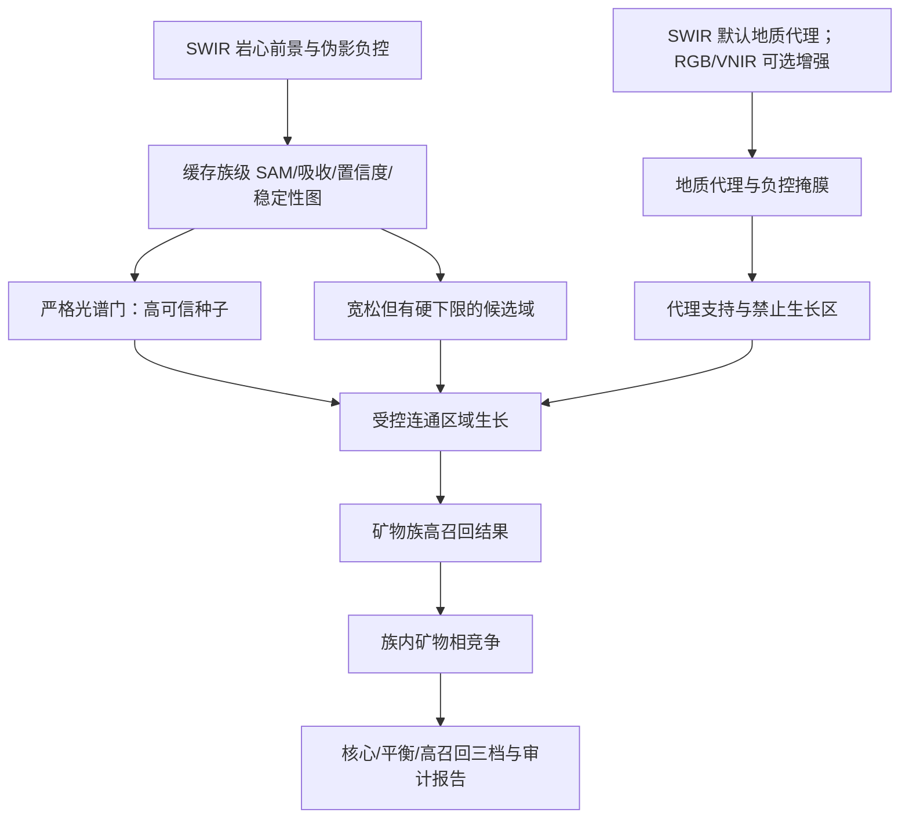

# CoreSpec Mapper 地质代理引导的自适应阈值与种子区域生长策略设计

- 文档版本：1.0
- 日期：2026-08-18
- 建议方法名：GATS（Geology-guided Adaptive Threshold and Seed-growing，地质代理引导的自适应阈值与种子生长）
- 文档状态：软件优化设计基线；尚未表示本方案已完整接入正式矿物识别流程
- 核验基础：当前 V5.3 阈值与分类代码、运行时矿物 Catalog、ZK5511 实测结果、用户提供的方解石示例图，以及 VNIR 稀土经验谱候选的种子区域生长试验
- 适用对象：算法研发、桌面端开发、项目配置、地质专家复核、软件测试与工程验收

> 重要边界：本文讨论的是如何提高候选召回、减少反复人工放宽阈值，并使放宽过程可解释、可审计。白色条带、空间连续性或阈值放宽本身均不能证明矿物相。最终矿物学结论仍需标准样品、点光谱、XRD、拉曼、薄片、化验或专家配准复核。

## 1. 核心结论

当前软件并非“没有宽松档”，而是整体仍属于**多道严格证据门串联、精度优先、漏检代价表达不足**的策略。现有三档 `conservative / balanced / sensitive` 已能在 Catalog 的安全包络内改变列分位阈值和绝对 SAM 阈值，但后续还要依次通过吸收深度、类间竞争、参考谱一致性、稳定性、置信度、SFF 和空间清理。多个条件以“且”的方式叠加后，即使每一项只略偏严格，最终保留下来的像元仍可能显著偏少。

当前自动阈值目标函数强调光谱证据和伪影惩罚，却没有直接衡量“具有地质意义的可见脉体是否被漏掉”。因此，低覆盖但较纯净的结果容易被判为优选，用户随后不得不多次手动要求放宽。

建议将正式策略升级为：

1. **SWIR 仍是常规蚀变矿物识别的默认主路线**，不把 RGB 是否存在作为运行前提。
2. 将严格阈值用于生成高可信光谱种子，将更宽松阈值用于生成候选域。
3. 宽松候选像元不能自行形成新斑块，只能在满足连通性、局部谱形、地质代理和伪影约束时，从高可信种子向外生长。
4. 对方解石—白云石—菱铁矿等易混矿物，先在**碳酸盐族**层级完成召回，再在生长区域内部进行矿物相竞争；无法可靠区分时保留为“碳酸盐族候选”，不强制标成方解石。
5. 将专家提出的“白色条带覆盖情况”转化为**地质可见脉体代理**，用于衡量召回和选择阈值拐点，但不将其当成方解石真值。
6. 将 `balanced` 调整为面向工程解释的默认高召回结果：高可信种子 + 受控区域生长；`conservative` 保留为核心证据；`sensitive/high-recall` 用于人工复核。
7. 阈值由多级扫描曲线和风险约束选择，不再按固定像元比例“制造结果”，也不以覆盖全部白色区域为目标。

该升级可概括为：**严格种子保证可信度，宽松候选保证召回，空间—地质约束控制误报，分层分类保护矿物学边界。**

## 2. 当前阈值策略审计

### 2.1 当前执行链

当前自适应路线的主要过程为：


现有框架的优点必须保留：

- 阈值搜索受 Catalog 安全包络限制，避免完全无界的自动放宽；
- 具备 `conservative / balanced / sensitive` 三档结果；
- 能输出 SAM、特征、置信度、稳定性、固定列风险、边缘风险和拒绝原因；
- 已考虑窄长条带、固定探测器列、边缘混合像元和小斑块；
- 三档结果有嵌套保护，强证据结果不会被更弱档反向否决；
- 阈值选择和后处理均能形成审计记录。

### 2.2 当前主要矿物族阈值快照

以下为 2026-08-17 核对的运行时 Catalog 快照。列分位表示每列进入初始候选的比例，SAM 单位为弧度；它们是组级候选阈值，不是最终矿物相判断的全部条件。

| 矿物族 | 保守档：列分位 / SAM | 平衡档：列分位 / SAM | 敏感档：列分位 / SAM |
|---|---:|---:|---:|
| 碳酸盐族 | 2.0% / 0.085 | 6.0% / 0.115 | 12.0% / 0.150 |
| 钙硫酸盐族 | 1.5% / 0.105 | 5.0% / 0.140 | 10.0% / 0.180 |
| 白云母—伊利石族 | 2.0% / 0.075 | 5.5% / 0.105 | 11.0% / 0.140 |
| 蒙脱石族 | 1.5% / 0.080 | 5.0% / 0.115 | 10.0% / 0.155 |
| 高岭石族 | 1.5% / 0.070 | 4.5% / 0.095 | 9.0% / 0.125 |

当前空间清理通常还采用 61 行纵向窗口、`min_component=3`，并对固定列、窄长条带和岩心边缘施加惩罚；强证据保护阈值大多约为 0.75—0.76。

### 2.3 当前自动阈值目标函数的偏向

当前校准目标可概括为：

\[
J_{current}=1.25E+0.35C+0.25S-0.90F-0.45B-0.55I-1.35O
\]

其中：

- \(E\)：光谱证据强度；
- \(C\)：覆盖效用；
- \(S\)：空间支持；
- \(F\)：固定列惩罚；
- \(B\)：边缘惩罚；
- \(I\)：孤立小连通域惩罚；
- \(O\)：过覆盖惩罚。

这一目标有利于控制伪影，但存在五个与本次需求直接相关的问题：

1. **没有显式漏检代理。** 覆盖效用只反映数量是否过少，并不知道漏掉的是否恰好是清晰脉体。
2. **覆盖激励弱于多类惩罚。** 覆盖效用权重为 0.35，而过覆盖、固定列和小连通域等惩罚合计更强，最优点自然倾向较少结果。
3. **串联证据门产生乘法式收缩。** SAM 放宽后，吸收深度、margin、共识、稳定性、置信度和空间清理仍可继续大量剔除。
4. **全局目标不足以表达分深度地质差异。** 某些深度段真实蚀变强、某些段弱，统一阈值容易在弱段漏检或在强反射段误检。
5. **敏感档仍是逐像元独立判定。** 它扩大候选范围，却没有利用“高可信像元附近更可能属于同一脉体”的结构信息，因此继续放宽时容易先增加散点，而不是补齐有意义斑块。

因此，后续优化不应只是继续增加某个 SAM 数值或降低所有证据门，而应改变阈值的职责分工。

## 3. 对专家“白色条带覆盖”意见的科学转化

### 3.1 从示例图能够得到什么

用户提供的方解石示例图中，红色识别结果较多沿岩心中的白色裂隙充填体和条带分布。这说明结果与肉眼可见地质结构具有一定一致性，也说明“识别结果对明显脉体的覆盖情况”能够帮助判断当前阈值是否过严。

同时，图中仍可观察到：

- 一些白色条带只被局部覆盖；
- 存在少量离散红色/紫色像元；
- 隔板、边缘、强反射点和细裂隙附近可能出现混合像元风险；
- 白色区域的成因和矿物组成并不唯一。

因此，专家意见应当被采纳，但需要从“颜色等于矿物”转化为“地质结构为阈值选择提供召回反馈”。

### 3.2 地质代理的定义

建议将白色条带定义为：

> **地质可见脉体代理（Geological Proxy Mask）**：由 RGB、VNIR、SWIR 亮度/局部对比、线性形态和专家标注共同得到的、可能代表裂隙充填或浅色蚀变结构的区域。它用于评价结构覆盖和引导候选生长，不等同于任何具体矿物相的真值。

应同时维护三类代理：

| 代理类型 | 含义 | 软件用途 |
|---|---|---|
| `proxy_positive_reviewed` | 专家确认“该段地质结构值得被目标矿物族检查/覆盖”的脉体 | 阈值召回评价、段级种子提升、验收 |
| `proxy_visible_auto` | 软件自动提取的浅色条带/裂隙充填候选 | 弱引导、曲线趋势、预览，不作硬真值 |
| `proxy_negative` | 托盘、隔板、标签、空隙、高光、阴影边缘、坏列等负控区域 | 生长禁止区、误报统计和质量门 |

### 3.3 为什么不能追求 100% 白色覆盖

肉眼白色区域可能包括方解石、白云石、石膏/硬石膏、高岭石化物质、石英、长石、风化粉末、标签、高光或混合像元。若用方解石结果强行覆盖所有白色区域，会把一个有价值的经验判断变成错误的监督信号。

正确目标应为：

1. 在光谱证据仍合理时，明显提高**专家确认的目标矿物族相关脉体**覆盖率；
2. 观察阈值放宽后，代理内覆盖收益是否开始饱和；
3. 同时观察代理外扩张、负控误报、固定列、边缘和散点是否开始加速；
4. 在“覆盖收益趋缓、误报风险加速”的拐点停止放宽。

## 4. 推荐的新总体方法：GATS

### 4.1 总体数据流



### 4.2 第一步：构建可靠的前景与负控

所有阈值策略必须在批准的岩心前景内运行。以下区域原则上不得成为生长通道：

- 岩心盒、托盘边框和中间隔板；
- 标签、标尺和人工标记；
- 岩心间空隙与深阴影；
- 饱和高光和明显镜面反射；
- 固定探测器列、重复窄条带和坏波段诱发伪影；
- 配准不可靠时的 RGB/VNIR 边缘区域。

负控优先级应高于白色代理。即使某一负控像元很亮，也不应因“白色”而进入生长域。

### 4.3 第二步：一次计算并缓存证据图

对每个矿物族一次性计算并缓存：

- 最佳及次佳参考谱 SAM；
- 吸收深度、吸收中心和深度比；
- 参考谱共识、竞争 margin、SFF（适用时）；
- 置信度、稳定性和局部谱形连续性；
- 固定列、边缘、饱和和条带风险；
- 分深度段统计量。

阈值扫描和区域生长只作用于这些二维证据图，不应为每个阈值重新读取和计算完整高光谱立方体。

### 4.4 第三步：严格门生成高可信种子

高可信种子继续使用当前保守或更接近平衡下界的证据组合：

\[
Seed = Foreground \cap Spectral_{strict} \cap Feature_{strict} \cap Stable \cap \neg Artifact
\]

种子应满足：

- SAM 位于严格区间；
- 目标吸收深度和中心合理；
- 参考谱共识和稳定性较高；
- 与主要混淆矿物有足够族级证据差异；
- 不在负控、固定列、饱和或高风险边缘。

严格种子的职责是“确定从哪里开始”，不是承担完整的矿物分布召回。

### 4.5 第四步：宽松门生成候选域

候选域允许使用明显宽于种子的阈值，但必须保留不可突破的硬下限：

\[
Candidate = Foreground \cap Spectral_{loose} \cap Feature_{floor} \cap \neg HardArtifact
\]

候选域可以：

- 放宽 SAM 上限和列分位范围；
- 降低最低吸收深度，但不能降到噪声水平以下；
- 在矿物族阶段弱化矿物相 margin；
- 放宽单像元参考谱一致性，转而要求邻域或段级一致性；
- 对已得到地质代理支持的区域使用较宽阈值；
- 对代理外区域保持较严格阈值。

候选域不能：

- 跨越托盘、隔板、空隙或负控区域；
- 因亮度较高而绕过最低光谱证据；
- 按预设矿物面积配额强制产生结果；
- 允许任何宽松像元自行创建新异常斑块。

### 4.6 第五步：种子约束区域生长

基础规则采用 8 邻域连通：候选域中只有与高可信种子连通的像元才能进入结果。当前已验证的基本实现思想是形态学传播/重建：

\[
Grow = Reconstruction(Seed, Candidate)
\]

正式接入常规 SWIR 矿物时，建议在基础连通约束上再增加四层控制：

1. **局部谱形连续性**：新增像元与其已接受邻域的 SAM、吸收中心或深度差不能突变。
2. **代理加权**：位于目标矿物族适用代理中的像元可使用较宽门；代理外像元需要更强的光谱证据。
3. **弱证据跨越限制**：允许跨越 1—2 个局部混合像元来连接同一脉体，但禁止沿连续弱证据走廊无限传播。
4. **分段风险门**：当某深度段的代理外增长率、固定列占比或边缘占比突然升高时，停止该段继续放宽。

这样可以优先补齐已有斑块和条带，而不是随着阈值放宽不断制造孤立小点。

### 4.7 无严格种子的整段脉体：代理辅助段级种子

单纯种子生长有一个天然盲点：如果一条真实但整体较弱的脉体内没有任何像元通过严格种子门，则整条脉体仍不会被识别。为此建议增加受严格限制的“段级种子提升”：

1. 将地质代理分成独立脉体/条带组件；
2. 对每个组件计算族级最佳若干像元的稳健光谱证据、吸收中心一致性和负控风险；
3. 若组件内没有严格种子，但其 Top-k 或高分位证据达到“次强种子”标准，可生成一个 `proxy_promoted_seed`；
4. 该种子只允许在本代理组件及邻近候选域内生长；
5. 输出必须单独记录来源和较低置信等级，供专家复核。

这一步不能由白色亮度单独触发。没有最低目标族光谱证据的白色组件仍应保持未分类。

### 4.8 先矿物族召回，再矿物相判别

白色条带最适合提示“裂隙充填/浅色矿物族可能存在”，通常不足以区分方解石、白云石和菱铁矿。推荐顺序为：

1. 在碳酸盐族层级用种子—候选域—生长提高召回；
2. 仅在族级生长结果内部，依据吸收中心、完整谱形、参考谱一致性和第一/第二名 margin 做相级竞争；
3. 相级证据充分时输出方解石、白云石或菱铁矿；
4. 相级证据不足时输出“碳酸盐族候选/不确定”，不得为了图面完整强行分相。

同一原则适用于钙硫酸盐、白云母—伊利石、高岭石—地开石等易混组合。

## 5. 地质代理的多源构建路线

### 5.1 默认：直接从 SWIR 构建

为保证没有 RGB 时仍能工程运行，SWIR 应同时承担默认识别和默认弱地质代理构建：

- 在避开强吸收和坏波段的多个连续谱窗口估计稳健亮度/伪反照率；
- 使用局部对比而非全局固定亮度，适应不同岩性和曝光；
- 提取细长、分叉或连续的高亮结构；
- 结合岩心边界距离排除外缘高光；
- 对固定列和纵向条带进行专门扣除；
- 仅将其作为 `proxy_visible_auto`，不直接参与矿物相赋值。

SWIR 代理不依赖伴随影像配准，工程上最稳定，适合作为默认路线。

### 5.2 有可靠 RGB 时的增强路线

RGB 对肉眼白色脉体和岩心结构通常更直观，可使用：

- 高亮度；
- 低色度/低饱和度；
- 相对周围围岩的局部对比；
- 细长性、骨架连续性、宽度和方向稳定性；
- 颜色与高光特征分离。

但 RGB 必须先配准到 SWIR 网格并通过叠加复核。若配准被标记为 `registration_review_required`，RGB 只能用于并排预览和人工判断，不得自动引导逐像元生长。RGB 与 SWIR 的边缘重合、隔板位置、岩心断点和控制点残差均应写入配准 QA。

### 5.3 无 RGB、但有 VNIR 时

可从 VNIR 的稳健亮度、低色度伪彩色、局部对比和连续结构得到可见代理。其使用条件与 RGB 相同：只有配准通过后才能逐像元融合；否则只用于复核。

### 5.4 模态优先级

| 数据条件 | 默认策略 |
|---|---|
| 只有 SWIR | SWIR 识别 + SWIR 弱地质代理，完整可运行 |
| SWIR + VNIR | SWIR 为常规矿物主路线；VNIR 代理仅在配准通过时增强 |
| SWIR + RGB | SWIR 为主路线；RGB 白色脉体代理在配准通过时增强 |
| SWIR + VNIR + RGB | 三者均保留独立 QA；代理融合不能替代 SWIR 光谱证据 |

## 6. 新阈值选择指标与拐点策略

### 6.1 必须新增的指标

设检测结果为 \(D\)，专家确认的正代理为 \(P^+\)，自动可见代理为 \(P_a\)，负控为 \(P^-\)，岩心前景为 \(F\)。

**专家正代理覆盖率：**

\[
ProxyCoverage=\frac{|D\cap P^+|}{|P^+|}
\]

用于回答“应被检查/覆盖的脉体有多少被目标矿物族捕获”。只有经过专家确认的代理才适合做硬验收。

**检测结果的代理内占比：**

\[
OnProxyShare=\frac{|D\cap(P^+\cup P_a)|}{|D|}
\]

它表示与可见结构的空间一致程度，不应命名为矿物精度或纯度。

**代理外增长率：**

\[
OffProxyGrowth=\frac{|D_t\setminus(P^+\cup P_a)|-|D_{t-1}\setminus(P^+\cup P_a)|}{|F|}
\]

用于监测阈值每放宽一级，非代理区域是否突然大量扩张。

还应记录：

- 高可信种子保留率；
- 负控误报率；
- SAM、吸收深度、置信度和稳定性的分位数；
- 同类邻域支持率；
- 连通分量数、中位面积、最大面积和细长性；
- 沿深度区段覆盖率及突变；
- 固定列、边缘、饱和、窄条带占比；
- `strict_seed / connected_growth / proxy_promoted` 三种来源像元数。

### 6.2 推荐的新目标函数

建议按矿物族配置权重：

\[
J_{GATS}=w_EE+w_GG+w_SS+w_DD+w_RR-w_OO-w_AA-w_UU
\]

其中：

- \(E\)：光谱证据质量；
- \(G\)：专家正代理覆盖及自动代理覆盖趋势；
- \(S\)：空间连续性与合理斑块尺度；
- \(D\)：分深度一致性；
- \(R\)：高可信种子保留率；
- \(O\)：代理外扩张；
- \(A\)：负控、边缘、固定列和条带伪影；
- \(U\)：阈值扰动不稳定性。

白色代理不适用的矿物族应令 \(w_G=0\)，避免错误先验污染结果。

### 6.3 多阈值扫描与拐点选择

对每个矿物族从严格到宽松生成阈值序列，绘制：

- 正代理覆盖率曲线；
- 代理外增长曲线；
- 负控误报曲线；
- 光谱证据中位数/低分位曲线；
- 斑块数量和尺度曲线；
- 固定列与边缘风险曲线。

推荐阈值是满足硬质量门的候选中，**代理覆盖边际收益开始下降且风险边际增长开始上升之前的拐点**。可使用以下边际比辅助判断：

\[
K_t=\frac{\Delta ProxyCoverage_t}{\Delta OffProxyGrowth_t+\Delta ArtifactRisk_t+\epsilon}
\]

当 \(K_t\) 连续下降、代理覆盖趋于饱和或负控误报突然上升时停止放宽。软件应显示推荐点及其前后两级结果，允许专家做有记录的调整。

## 7. 三档结果的重新定义

| 档位 | 新定义 | 默认用途 | 发布边界 |
|---|---|---|---|
| `conservative` | 严格光谱种子核心，少量必要清理 | 高可信核心、抽样验证 | 可作为最可信候选，但仍非矿物学真值 |
| `balanced` | 严格种子 + Catalog 内宽松候选 + 受控生长；建议作为新默认 | 工程填图与专家解释 | 通过 QA 后发布为矿物候选图 |
| `sensitive` / `high-recall` | 更宽候选、代理辅助段级种子和更弱局部门 | 尽量不漏的人工复核层 | 必须明确高召回/待复核 |
| `exploratory`（可选） | 允许超过常规安全包络的研究试验 | 参数研究和新矿物探索 | 不得混入正式成果；单独目录和显著水印 |

### 7.1 建议的初始参数关系

以下只作为接入后的首轮试验起点，不能未经 ZK5511 和多钻孔验证直接固化为生产数值。

| 参数 | `conservative` | `balanced` | `high-recall` |
|---|---|---|---|
| 种子门 | 当前保守档或更严格 | 复用保守种子 | 复用平衡/保守种子并保留来源 |
| 候选 SAM 上限 | 接近种子门 | 可到当前敏感档包络 | 可在专门 `exploration_cap` 内比敏感档再宽 10%—15% |
| 最低吸收深度 | 当前保守档 | 当前敏感档附近的硬下限 | 仅对代理支持区进一步降低，仍高于噪声估计 |
| 矿物相 margin | 严格 | 族级阶段弱化，相级阶段恢复 | 族级可更弱；不确定相保留族标签 |
| 邻域支持 | 强 | 3×3 中至少 2—4 个候选或代理支持 | 可降低，但不能允许孤立候选自成新斑块 |
| 弱证据跨越 | 0—1 像元 | 最多 1 像元 | 最多 2 像元且需代理/两端强证据 |
| 小组件规则 | 保持现状 | 与种子连通的细脉不按统一面积删除 | 无种子孤岛仍删除；代理提升组件单独标记 |

这里的关键不是一味增大绝对阈值，而是将更宽的阈值限定在“候选域”和“受控传播”阶段。

## 8. 不同矿物族的代理适用边界

| 目标 | 白色/浅色脉体代理适用性 | 推荐策略 |
|---|---|---|
| 碳酸盐族 | 高，但只到矿物族层级 | 重点使用白色脉体覆盖、种子生长和族内再分相 |
| 方解石 | 中等；白色脉体并非方解石专属 | 以碳酸盐族覆盖为主，方解石标签必须通过相级竞争 |
| 石膏—硬石膏 | 中等偏弱 | 可使用浅色填充体弱代理，并与碳酸盐族进行竞争 |
| 高岭石—地开石 | 弱 | 白色只作弱提示，核心仍是 2.17/2.20 μm 双吸收结构 |
| 白云母—伊利石 | 低 | 主要依赖 Al-OH 谱形、空间连续性和深度一致性 |
| 蒙脱石族 | 低 | 主要依赖水/OH 特征、局部连续性和分段稳定性 |
| 绿泥石、滑石等 Mg-Fe-OH 族 | 通常低 | 不使用白色代理，采用光谱种子和族级空间生长 |
| VNIR 稀土经验谱异常 | 不适用 | 使用谱形种子、宽松候选、连通生长和稳定性；始终标为经验谱相似性异常 |

代理权重必须按矿物族配置，不能用同一白色掩膜引导所有矿物。

## 9. VNIR 稀土种子生长试验对本方案的启示

ZK5511 的 VNIR 稀土经验谱候选已完成一次高召回种子区域生长试验。该试验不是稀土矿物学验证，但可作为机制可行性的工程证据：

| 指标 | 先前宽松版 v7 | 种子生长 v8 | 变化 |
|---|---:|---:|---:|
| 平衡档像元 | 1,380 | 12,488 | 约 9.0 倍 |
| 敏感档像元 | 3,277 | 20,181 | 约 6.2 倍 |
| 平衡档连通分量中位面积 | 15 像元 | 25.5 像元 | 斑块更完整 |
| 平衡档最大分量 | 77 像元 | 1,267 像元 | 连续候选得到明显补齐 |

v8 三档保持嵌套，审计状态为 `ready`。这说明“严格种子 + 宽松候选域 + 只允许连通传播”能显著提高召回并扩大有结构的斑块，而不仅是增加随机散点。

但必须明确：

- 这些像元仍是 **VNIR 稀土经验谱相似性异常**，不是已确认稀土矿物、含量或品位；
- 数量增加不能替代 XRD、化验或专家真值；
- v8 使用的激进角度部分超过两条用户参考谱之间的分离尺度，只适合高召回复核，不应直接移植为常规 SWIR 矿物的绝对阈值；
- 常规 SWIR 集成应复用“方法结构”，按各矿物族重新标定阈值和代理权重。

## 10. 软件工程接入建议

### 10.1 保持原流程，采用可回退增强

不建议重写现有 V5 证据引擎。新能力应在当前候选和分类之间增加一个可开关的空间推断层：

1. 原有证据图、Catalog、拒绝原因和严格结果保持不变；
2. 新增 GATS 结果写入独立文件和独立审计字段；
3. 首轮以 `shadow mode` 同时输出旧平衡档和 GATS 平衡档；
4. 多钻孔验收前，旧流程仍可一键回退；
5. 不覆盖既有严格成果和用户工作区结果。

### 10.2 建议代码落点

| 模块 | 建议职责 |
|---|---|
| 新建 `geology_proxy.py` | SWIR/RGB/VNIR 代理构建、代理组件、负控和配准质量门 |
| 新建或抽象 `spatial_growth.py` | 种子传播、局部连续性、弱间隙限制、段级种子提升和来源追踪 |
| 扩展 `v5_threshold_trial.py` | 多阈值扫描、代理指标、拐点选择和候选审计 |
| 扩展 `v5_calibration.py` | 新目标函数、矿物族权重、分深度约束和硬质量门 |
| 接入 `v4_pipeline.py` | 在族级候选与相级竞争之间插入可选 GATS 层 |
| 扩展 `desktop_v5.py` | 阈值曲线、代理叠加、种子/生长来源、专家标注和推荐点确认 |
| 扩展 QA/Manifest | 代理覆盖、代理外增长、负控误报、增长审计、配置和哈希 |

### 10.3 建议配置结构

```json
{
  "threshold_strategy": {
    "mode": "gats",
    "default_profile": "balanced",
    "preserve_legacy_outputs": true,
    "feature_cache": true,
    "profiles": {
      "conservative": {"seed_policy": "conservative", "growth": false},
      "balanced": {
        "seed_policy": "conservative",
        "candidate_policy": "sensitive",
        "growth": true,
        "maximum_weak_gap_pixels": 1
      },
      "high_recall": {
        "seed_policy": "balanced",
        "candidate_policy": "high_recall_cap",
        "growth": true,
        "maximum_weak_gap_pixels": 2,
        "allow_proxy_promoted_seed": true,
        "review_required": true
      }
    },
    "proxy": {
      "default_source": "swir",
      "optional_sources": ["registered_rgb", "registered_vnir"],
      "require_registration_approval": true,
      "family_weights": {
        "carbonate_2300": 1.0,
        "calcium_sulfates": 0.5,
        "kaolin_2170_2205": 0.2,
        "white_mica_illite": 0.0,
        "smectites": 0.0,
        "vnir_ree_empirical": 0.0
      }
    }
  }
}
```

实际字段应与现有配置模型统一；该片段用于表达职责和审计结构，不是可直接投入生产的最终配置。

### 10.4 必须新增的输出

每个矿物族至少输出：

- `strict_seed_mask`；
- `loose_candidate_mask`；
- `geology_proxy_mask` 和 `proxy_negative_mask`；
- `connected_growth_mask`；
- `proxy_promoted_seed_mask`；
- `growth_source_code`；
- 阈值扫描 CSV/JSON；
- 覆盖—风险曲线；
- 分深度段统计；
- 旧/新结果差异图；
- 代理适用性、配准状态和人工批准记录。

## 11. 桌面端交互建议

阈值页面不应只显示一个数值滑块。建议增加：

1. 底图、严格种子、候选域、受控生长和最终相级结果的独立开关；
2. 专家正代理、自动白色代理和负控的不同颜色叠加；
3. “代理覆盖—代理外增长—伪影风险”三条同步曲线；
4. 自动推荐拐点、前一级和后一级的并排预览；
5. 每次人工调整记录操作者、原因和指标变化；
6. 明确显示当前结果属于核心、平衡、高召回还是探索档；
7. 对 `proxy_promoted` 结果使用单独图例，提醒其证据低于严格种子；
8. 对配准未批准、负控异常或阈值超出 Catalog 的结果显示阻断或显著警告。

这样专家提出的经验不再依赖每次口头要求“再放宽一点”，而会变成可见、可比较、可追溯的决策过程。

## 12. 性能与大数据工程化要求

新策略增加的是二维掩膜和证据图运算，不应重复进行完整光谱计算。建议：

- ENVI 立方体继续使用 `memmap` 和分块/逐行读取；
- SAM、吸收特征、置信度和风险图一次生成、重复复用；
- 多阈值扫描采用排序、累计统计或直方图，避免逐阈值全图重算；
- 区域生长在布尔/低精度二维数组上进行；
- 超长影像按深度块处理，块间保留重叠带和连通标签拼接；
- 缓存写入包含输入哈希、Catalog 哈希、参考谱哈希和参数哈希，防止误用旧缓存；
- 记录 CPU/GPU、峰值内存、处理像元数、光谱特征耗时、阈值扫描耗时和区域生长耗时。

工程验收时不应预先承诺未经测量的绝对秒数。应要求：阈值重新选择不再重新读取完整立方体；同一缓存上的二次扫描显著快于首次光谱特征提取；内存随块尺寸而非完整钻孔长度增长；相同输入和配置可复现完全一致的输出。

## 13. 验证与验收方案

### 13.1 数据集设计

至少覆盖：

- 暗色、浅色、湿润、破碎和强反光岩心；
- 碳酸盐脉发育与不发育区段；
- 石膏/硬石膏、高岭石或浅色硅酸盐等混淆场景；
- 托盘、隔板、标签、空隙和固定列伪影；
- 不同钻孔、不同成像批次和不同曝光条件；
- 有 RGB/VNIR 配准数据与只有 SWIR 的两类场景。

训练/调参与验收必须按钻孔或岩心箱分组，不能把同一连续岩心的相邻小块随机分到训练和测试中。

### 13.2 标注层级

需要分开标注：

1. 岩心前景与负控；
2. 自动白色代理和专家确认的目标族相关脉体；
3. 光谱/矿物学真值点或真值区域；
4. 仅可见但矿物不确定的脉体；
5. 典型混淆矿物和伪影。

白色代理标注不能与矿物真值标注混为同一类别。

### 13.3 对比试验

至少进行四组消融：

| 方案 | 用途 |
|---|---|
| 当前 V5.3 平衡档 | 基线 |
| 仅放宽逐像元阈值 | 证明单纯放宽造成的散点/误报变化 |
| 种子 + 候选域 + 连通生长 | 验证空间机制 |
| 完整 GATS（含地质代理和拐点） | 验证专家经验融合的增益与风险 |

### 13.4 首轮建议验收门

以下为建议的工程门，最终数值需由多钻孔试验和专家共同冻结：

- 三档嵌套零违反，平衡/高召回不得丢失严格种子；
- 对专家明确标为碳酸盐族相关的正代理脉体，平衡档族级覆盖率以 85% 为首轮目标；不能达到时必须输出拒绝原因，而不是静默漏检；
- 自动白色代理覆盖率只用于趋势，不作为矿物准确率验收；
- 负控、固定列、边缘和饱和区域的误报不得因放宽出现突增；
- `proxy_promoted` 像元必须可单独关闭并可追溯到具体代理组件；
- 与当前敏感档相比，新增像元应更多用于补齐既有组件，而不是主要增加无种子的孤立组件；
- 阈值轻微扰动时，主要斑块位置应稳定；
- 每个深度段均应通过覆盖突变和伪影突变检查；
- 有独立矿物学真值时，必须分别报告族级和相级 Precision、Recall、F1/IoU，不能用代理覆盖替代。

### 13.5 证据等级

| 等级 | 可以声称 | 不可以声称 |
|---|---|---|
| 工程 QA 通过 | 流程完整、结果可复现、无明显固定列/配准/嵌套问题 | 矿物识别准确率已经验证 |
| 专家代理复核通过 | 结果与可见地质结构较一致、漏检明显减少 | 白色区域均为目标矿物 |
| 独立矿物学验证通过 | 在给定样本和真值条件下的族级/相级性能 | 对所有钻孔无条件泛化 |

## 14. 分阶段实施路线

### 阶段 A：只增加指标，不改变结果

- 冻结当前 V5.3 输出；
- 构建 SWIR 自动代理和负控；
- 增加代理覆盖、代理外增长、深度段和斑块统计；
- 让专家核对代理是否表达了其经验。

### 阶段 B：影子模式接入种子生长

- 复用现有严格结果作为种子；
- 在独立目录生成候选域和 GATS 结果；
- 与旧平衡/敏感档并排对比；
- 不替换正式输出。

### 阶段 C：碳酸盐族优先集成

- 先针对专家意见最明确的碳酸盐族实现；
- 完成族级生长和族内方解石—白云石—菱铁矿竞争；
- 验证白色脉体召回、混淆矿物和负控风险。

### 阶段 D：按适用性推广

- 钙硫酸盐和高岭石使用弱代理；
- 伊利石、蒙脱石和 Mg-Fe-OH 族主要使用光谱—空间生长；
- 稀土经验谱路线保持独立 VNIR 审计和谨慎命名。

### 阶段 E：多钻孔冻结默认策略

- 在独立钻孔盲测；
- 冻结各矿物族权重、硬下限和质量门；
- 达到验收条件后，再将 GATS `balanced` 设为软件默认；
- 保留旧 V5.3 模式用于回归和一键回退。

## 15. 风险边界与禁止做法

1. 不将白色条带直接编码为方解石标签。
2. 不为提高图面数量而按固定百分比分配矿物像元。
3. 不同时无界放宽 SAM、吸收深度、margin、置信度和空间清理。
4. 不允许宽松候选在没有种子或段级证据提升的情况下形成新岛。
5. 不允许区域生长跨越托盘、空隙、隔板和高风险坏列。
6. 不在 RGB/VNIR 配准未批准时进行逐像元代理融合。
7. 不把族级召回改善表述为矿物相准确率改善。
8. 不把 VNIR 稀土经验谱相似性异常表述为已确认稀土矿物、含量或品位。
9. 不用单钻孔或单张示例图直接冻结全项目生产阈值。
10. 不覆盖旧结果；所有新策略必须有版本、配置、哈希和来源审计。

## 16. 最终建议

本次软件阈值优化的重点不应是继续寻找一个“更大的统一阈值”，而应建立一个能表达地质经验、控制风险并自动找到合理放宽程度的机制。

建议正式采用以下设计决策：

- 方法名称采用 **GATS：地质代理引导的自适应阈值与种子区域生长**；
- 常规蚀变矿物继续以 SWIR 为默认，RGB/VNIR 作为配准通过后的增强信息；
- `conservative` 负责高可信种子，`balanced` 负责受控高召回并成为未来默认，`high-recall` 负责人工复核；
- 对碳酸盐等适用矿物族，将专家确认的白色脉体覆盖率纳入阈值选择，但以覆盖—风险拐点而非 100% 覆盖为停止条件；
- 先做矿物族召回，再做矿物相竞争；无法区分时保留族级不确定标签；
- 对没有严格种子的弱脉体，允许由段级稳健光谱证据触发可追溯的代理辅助种子，但绝不由白色亮度单独触发；
- 所有放宽必须同时输出新增像元来源、代理外增长、负控误报、斑块尺度、深度段异常和光谱证据变化；
- 先以影子模式完成 ZK5511 碳酸盐族验证，再推广到其他 SWIR 矿物族并进行多钻孔盲测。

这一策略能够把专家“看白色条带是否被充分覆盖”的经验，从一次次人工要求放宽，转化为软件内可计算、可视化、可回退和可验收的工程流程，同时保留光谱矿物识别必须遵守的证据边界。
